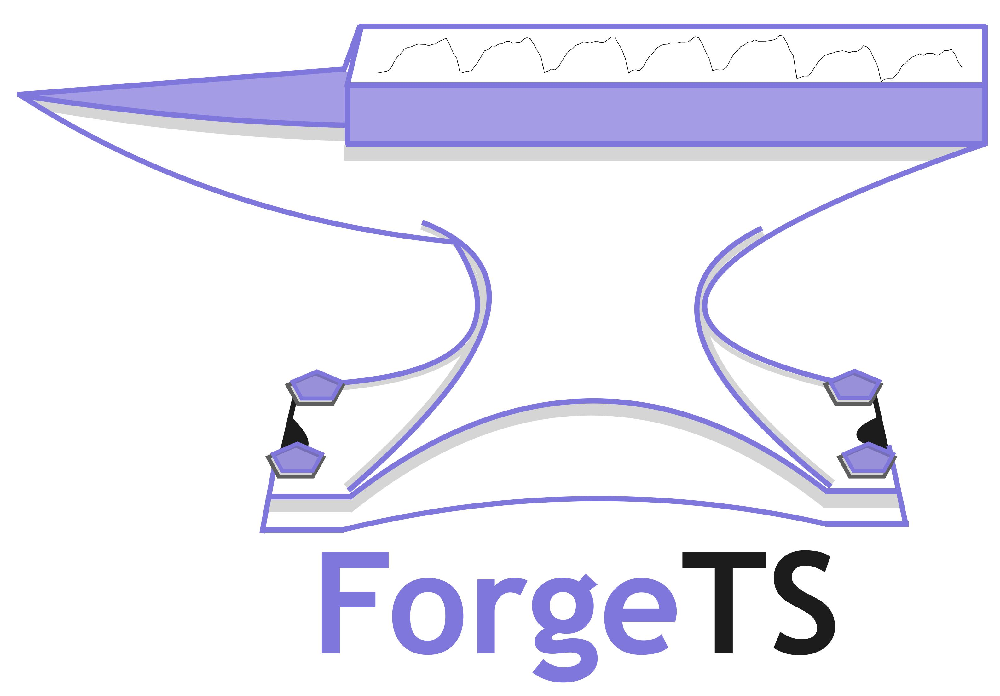
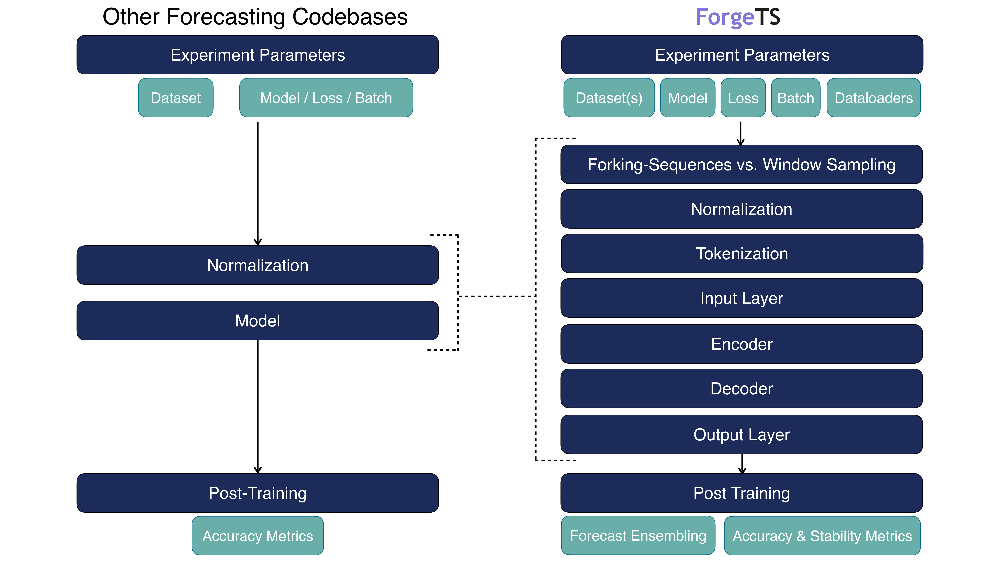
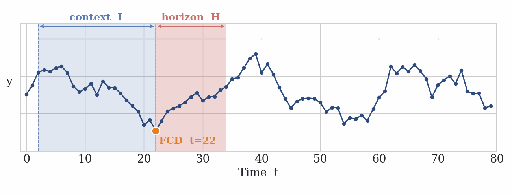
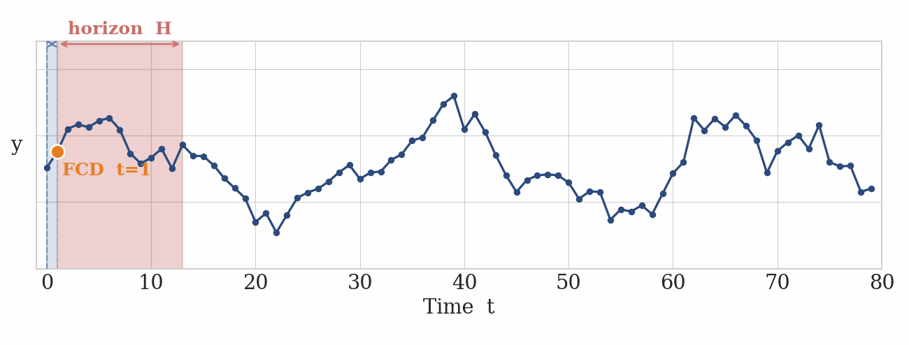

<a name="top"></a>

<p align="center">
  
  </p>


<p align="center">
  <em>Forge time-series forecasting architectures through controlled, component-level studies</em>
</p>

<br>

---

<br>


<p align="center">
  <a href="#overview">Overview</a> •
  <a href="#quick-start">Quick Start</a> •
  <a href="#modular-model-build">Modular Model Build</a> •
  <a href="#dataloaders">Dataloaders</a> •
  <a href="#forking-sequences">Forking Sequences</a> •
  <a href="#training">Training</a> •
  <a href="#validation-strategies">Validation Strategies</a> •
  <a href="#metrics">Metrics</a> •
  <a href="#inference">Inference</a> •
  <a href="#forecast-ensembling">Forecast Ensembling</a> •
  <a href="#citations">Citations</a> •
  <a href="#license">License</a>
</p>

<br>

---

<br>

## Overview

**Most forecasting codebases benchmark at the model level. ForgeTS benchmarks at the component level.**

<p align="center">
  
</p>

<br>

---

<br>

## Quick Start

### 1. Install
```bash
git clone git@github.com:PotosnakW/ForgeTS.git
cd forgets
pip install -e .
```

### 2. Edit Configs
```
configs/
  base/
    default.yaml        # shared training params (batch_size, lr, max_steps, etc.)
  dataset/
    simglucose.yaml     # experiment config (train/val/test splits, horizon_override)
    sources/
      simglucose.yaml   # dataset config (path, horizon, val_size, exog_cols, etc.)
  model/
    tstmomentmica.yaml  # model architecture config
  config.yaml           # top-level defaults
```

### 3. Run Experiment
```bash
cd experiments
python train_models.py dataset=simglucose model=tstmomentmica
```

<br>

[↑ Back to top](#top)

<br>

---

<br>


## Modular Model Build

When adding a model config file in `config/models/`, select encoder, decoder, and output layer.
Any component can be set to `none` to skip it.
```yaml
d_model: 256
encoder: patchtst      # or none
decoder: none          # or transformer, google/t5-efficient-tiny, etc.
output_layer: linear_proj  # or none
```

### Supported Tokenization
| `tokenization` | Notes |
|---|---|
| `fixed_patch` | Fixed-length patch tokenization with configurable `patch_len` and `stride` |
 
### Supported Input Layers
| `input_layer` | Key config params | Notes |
|---|---|---|
| `linear` | `dropout`, `positional_encoding` | Linear projection with optional positional encodings and dropout |
| `none` | — | No input layer — raw tokens passed directly to encoder |
 
### Supported Encoders
| `model_type` | `encoder` | Key config params |
|---|---|---|
| `transformer` | `patchtst` | `patch_len`, `stride`, `n_heads`, `n_layers`, `hidden_size` |
| `transformer` | `none` | — |
| `rnn` | `rnn` | `n_layers`, `hidden_size`, `dropout` |
| `rnn` | `lstm` | `n_layers`, `hidden_size`, `dropout` |
| `cnn` | `cnn` | `n_layers`, `hidden_size`, `dropout`, `kernel_size`, `dilations` |
| `none` | `none` | — |
 
### Supported Decoders
| `decoder` | Notes |
|---|---|
| `none` | No decoder — encoder output passed directly to output layer |
 
### Supported Output Layers
| `output_layer` | Notes |
|---|---|
| `linear_proj` | Projects last dimension to H × c_out, where c_out is the loss output dimension |
| `none` | No projection — returns encoder/decoder output as-is |


<br>

[↑ Back to top](#top)

<br>

---

<br>


## Dataloaders


### DataLoaderFactory

Central object that owns all dataset construction and dataloader creation.

```python
factory      = DataLoaderFactory(mcfg, dcfg)
train_loader = factory.train_dataloader()
val_loaders  = factory.val_dataloaders()
test_loaders = factory.test_dataloaders()
```

<br>

### FullSeriesDataset

Each dataset is a single item (`__len__ == 1`) — the entire series delivered to the model in one shot. `fork_sequences` handles all windowing inside `_prepare_batch`.

<br>


### `batch_sampler: HorizonBatchSampler`

Groups datasets by `(horizon, is_multivariate)` so all items in a batch share the same forecast length and data type. When `horizon_override` is set, all datasets collapse into a single group per multivariate flag, allowing free mixing across horizons. Univariate and multivariate datasets are always batched separately and never mixed within a batch. Ensure the `multivariate` flag is set correctly in each `source/{dataset}` config.


| `batch_mixing_strategy` | Behaviour |
|---|---|
| `concat` | All datasets in a horizon group are pooled into a single index space, weighted by dataset weight. The pool is shuffled and chunked into batches of `batch_size`. All datasets are seen per epoch but batch order is random. |
| `round_robin` | Batches are yielded one horizon group at a time, cycling across groups before repeating. Within each group, datasets are still weighted and pooled. Guarantees each horizon group gets a batch before any group repeats. With a single horizon group, identical to `concat`. |

<br>

[↑ Back to top](#top)

<br>

---

<br>

## Forking-sequences

Forking-sequences architectures generate forecasts for all FCDs simultaneously by reusing the encoder’s computations, whereas window-sampling produces forecasts for each FCD independently. We include an implementation of `forking-sequences` from the methods described in [1, 2]. 

<p align="center">
  
  
</p>

<p align="center">
  <em>(a) Window-Sampling &nbsp;&nbsp;&nbsp;&nbsp;&nbsp;&nbsp;&nbsp;&nbsp;&nbsp;&nbsp;&nbsp;&nbsp;&nbsp; (b) Forking-Sequences</em>
</p>


The `fcd_sample` parameter in the `configs/base/default.yaml` file. It can alternatively be specified in individual model configs in `configs/models/`

```python
from dataloaders._forking_sequences import ForkingSequences

# Training — sample FCDs per series
fs_call = ForkingSequences(context_length=512)
out = fs_call(batch, fcd_samples=4, horizon=6)
# Training — Use all FCDs per series
out = fs_call(batch, fcd_samples=-1, horizon=6)

# Val / Test — all valid windows, no sampling
out = fs_call(batch, fcd_samples=-1, horizon=6)
```


<br>

### `fcd_sampler`

Called during training (`fcd_samples != -1`) to pick one `window_start` per series.

```
`homogeneous`
Each series gets the same window_start index.
Any timestep is valid so long as L+H falls within the series length. 
Index sampling **does not** account for left-padding and mid-series gaps. 
──────────────────────────────────────────────────────────
series 1   [1 1 1 1 1 1 1 1 1 1 1 1 1 1 1 1 1 1 1 1 1 1 1]
                        [──── L ────][── H ──]

series 2   [0 0 0 0 0 0 1 1 1 1 1 1 1 1 1 1 1 1 1 1 1 1 1]
                        [──── L ────][── H ──]

series 3   [0 0 0 0 0 0 0 0 0 0 0 1 1 1 1 1 1 1 1 1 1 1 1]
                        [──── L ────][── H ──]
                          ^ ^ ^ ^ L samples padding
──────────────────────────────────────────────────────────

`heterogeneous`
Each series gets a unique window_start index.
A timestep is only valid so long as L+H falls within the series length and if **all channels** have real data there.
Index sampling **does** account for left-padding and mid-series gaps. 
──────────────────────────────────────────────────────────
series 1   [1 1 1 1 1 1 1 1 1 1 1 1 1 1 1 1 1 1 1 1 1 1 1]
               [──── L ────][── H ──]

series 2   [0 0 0 0 0 0 1 1 1 1 1 1 1 1 1 1 1 1 1 1 1 1 1]
                         [──── L ────][── H ──]

series 3   [0 0 0 0 0 0 0 0 0 0 0 1 1 1 1 1 1 1 1 1 1 1 1]
                                  [──── L ────][── H ──]
──────────────────────────────────────────────────────────
```

1. Wen, R., Torkkola, K., Narayanaswamy, B., & Madeka, D. (2018). *A Multi-Horizon Quantile Recurrent Forecaster*.

2. Potosnak, W., Wolff, M., Cao, M., Ma, R., Konstantinova, T., Efimov, D., Mahoney, M. W., Oreshkin, B., & Olivares, K. G. (2025). *Forking-Sequences*.

<br>

[↑ Back to top](#top)

<br>

---

<br>

## Training

### Single GPU
```python
from common.train import train

train(model, mcfg, train_loader, val_loaders, device=torch.device("cuda"))

# Resume from checkpoint
train(model, mcfg, train_loader, val_loaders, resume="checkpoints/final.pt")
```

### Multiple GPUs

**torchrun** (recommended):
```bash
torchrun --nproc_per_node=4 train_script.py
```

**mp.spawn** (programmatic, single-machine):
```python
from common.train import train_distributed

train_distributed(model, mcfg, factory, use_spawn=True, world_size=4)
```

Sharded datasets are the recommended backend for distributed training — each rank loads a non-overlapping subset of shard files.

| Phase | Behaviour |
|---|---|
| **Training** | Each rank receives a non-overlapping slice of every horizon group's pool. Padding ensures identical batch counts across ranks — required by DDP's barrier synchronisation. |
| **Validation** | Every rank evaluates the full val set independently (same data, different model weights). Losses are all-reduced and averaged for the global metric. Only rank 0 logs and saves checkpoints. |
| **Test** | Always single GPU. Call `eval_test()` after `dist.destroy_process_group()` has been called. |

### Data Sharding

For datasets too large to fit in RAM, `write_sharded_dataset` partitions data into time-blocked parquet files with configurable shard size.

#### Writing Shards

```python
from dataloaders.ts_sharding import write_sharded_dataset

write_sharded_dataset(
    df             = full_df,           # long-format DataFrame — must have 'available_mask'
    out_dir        = "data/sharded/simglucose",
    val_size       = 2592,              # matches dcfg entry val_size
    test_size      = 2592,              # matches dcfg entry test_size
    context_length = 512,               # L — baked into shard overlap
    shard_size     = 5_000,             # train timesteps per file
    hist_exog_cols = ["CHO", "insulin"],
)
```

#### Disk Layout

```
out_dir/
    shard_000000.parquet   # t = [0,          shard_size + L)
    shard_000001.parquet   # t = [shard_size,  2·shard_size + L)   ← L-row overlap
    ...
    val.parquet            # t = [train_end - L,  val_end)
    test.parquet           # t = [val_end - L,    T_total)
    static.parquet         # per-channel static features
    metadata.json          # split boundaries, schema, shard index
```

The **L-row right-edge overlap** on each train shard means windows near shard boundaries are self-contained — no cross-file reads needed.

#### Using Shards
First write the shards with `write_sharded_dataset`, then point your dataset config entry at the output directory:
```yaml
- name: "simglucose"
  sharded_dir: "data/sharded/simglucose"
  horizon: 6
  weight: 1.0
```

`path` is not required when `sharded_dir` is set. The factory uses `ShardedTrainDataset`, 
`ShardedValDataset`, and `ShardedTestDataset` directly.

<br>

[↑ Back to top](#top)

<br>

---

<br>

## Metrics

### Training Losses

Select the loss via `mcfg.loss`:

| `mcfg.loss` | Function | Extra config |
|---|---|---|
| `"mae"` | `mae_loss` | — |
| `"mse"` | `mse_loss` | — |
| `"huber"` | `huber_loss` | `delta: 1.0` |
| `"quantile"` | `quantile_loss` | `quantiles: [0.1, 0.5, 0.9]` |

All point-forecast losses share the same signature:
```python
loss_fn(
    preds:   torch.Tensor,         # [B, H, C]
    targets: torch.Tensor,         # [B, H, C]
    mask:    torch.Tensor | None,  # [B, H, C]  1=real, 0=padded/missing
) -> torch.Tensor                  # scalar
```

Masked reduction applied by every loss:
```python
(raw_loss * mask).sum() / mask.sum().clamp(min=1)
```

When `mask is None` a plain `.mean()` is used — equivalent to a mask of all ones.

<br>

### Accuracy Metrics
```python
from common.losses_np import mae, mse, rmse, mape, smape
```

| Function | Formula |
|---|---|
| `mae`   | `mean( \|y − ŷ\| )` |
| `mse`   | `mean( (y − ŷ)² )` |
| `rmse`  | `sqrt( mse )` |
| `mape`  | `mean( \|y − ŷ\| / \|y\| ) × 100` |
| `smape` | `mean( 2\|y − ŷ\| / (\|y\| + \|ŷ\|) ) × 100` |
```python
metric_fn(
    preds:   np.ndarray,        # [..., H, C]
    targets: np.ndarray,        # [..., H, C]
    mask:    np.ndarray | None, # [..., H, C]  1=real, 0=missing
) -> float
```
```python
preds   = results["simglucose"]["preds"].numpy()           # [n_fcds, H, C]
targets = results["simglucose"]["targets"].numpy()         # [n_fcds, H, C]
mask    = results["simglucose"]["outsample_mask"].numpy()  # [n_fcds, H, C]

print("MAE: ", mae(preds, targets, mask))
print("RMSE:", rmse(preds, targets, mask))
```

> **Quantile models** — pass only the median slice to point-forecast metrics:
> ```python
> Q   = len(mcfg.quantiles)
> mid = mcfg.quantiles.index(0.5)
> p_median = preds.reshape(*preds.shape[:-1], -1, Q)[..., mid]
> print("Median MAE:", mae(p_median, targets, mask))
> ```

<br>

### Stability Metrics

Stability metrics operate on the overlapping structure of forking sequences — multiple forecast windows predict the same target date from different horizons, so revisions across consecutive windows can be measured directly. Lower measurements are preferred.

```python
from common.losses_np import excess_volatility, forecast_percentage_change
```

#### Excess Volatility (EV)
Measures harmful forecast instability: revisions that incur a quantile-loss cost without a corresponding accuracy improvement.

<p align="center">
  
  
  
</p>
Fig. Example penalty behavior of the Excess Volatility (EV) metric. EV distinguishes accuracy-improving
revisions from accuracy-degrading ones, assigning no penalty when revisions improve accuracy, while asymmetrically penalizing both deteriorating and overshooting revisions according to their impact on accuracy.

<br>

```python
ev = excess_volatility(
    targets=targets, # [B, T, H, C]
    preds=preds, # [B, T, H, C, Q]
    quantiles=mcfg.quantiles, # [Q]
    mask=mask, # [B, C, H]
    scaling=True,
)
```


#### Symmetric Forecast Percentage Change (sFPC)

Measures the relative magnitude of revisions without reference to ground truth. Can be computed on live windows where targets are unavailable.

```python
sfpc = forecast_percentage_change(
    preds=p_median, # [B, T, H, C, Q]
    mask=mask, # [B, C, H]
    scaling=True,
)
```

<br>

[↑ Back to top](#top)

<br>

---

<br>

## Validation Strategies

Controlled by `mcfg.val_strategy`:

| Strategy | Behaviour | Best for |
|---|---|---|
| `exhaustive` | Full pass over all val datasets every check | Final evaluation, small dataset counts |
| `random_datasets` | K random datasets per check (`val_max_datasets`) | Many datasets, preventing val overfitting |
| `stratified` | One random dataset per horizon group | Fast convergence signal across all horizons |

> Test always uses `exhaustive` evaluation regardless of `val_strategy`.

<br>

[↑ Back to top](#top)

<br>

---

<br>


## Inference

```python
results = eval_test(model, factory, device=torch.device("cuda"))
```

Returns a nested dict keyed by dataset name:

```python
{
    "simglucose": {
        "channel_ids":    ["patient_001", "patient_002", ...],
        "preds":          Tensor,   # [n_fcds, H, C]
        "targets":        Tensor,   # [n_fcds, H, C]
        "outsample_mask": Tensor,   # [n_fcds, H, C]   1 = real, 0 = missing
    }
}
```

<br>

[↑ Back to top](#top)

<br>
 
---
 
<br>
 

## Forecast Ensembling
Because forking sequences produce multiple overlapping predictions for anygiven future timestep, ensembling these overlaps can meaningfully reduce
variance before computing final metrics.

<p align="center">
  
  
</p>
Fig. a) We adapt forking-sequences during inference to ensemble multiple forecasts of the same future date by
computing a function (ex., moving average) across predictions generated from previous FCDs. b) Forking-sequences
ensembling improves forecasts’ stability, reducing the estimators variance with a linear convergence rate analogous to
the weak law of large numbers.

<br>

```python
from common.ensembling import Ensembler

ensembler = Ensembler(ensemble_method='mean')
smoothed  = ensembler.ensemble(preds, mask=outsample_mask)
# [B, T, H, C]  →  [B, T, H, C]
```

### Methods

| `ensemble_method` | Behaviour | Key kwargs |
|---|---|---|
| `mean`     | Cumulative (or windowed) mean over overlapping windows   | `window_size=None` |
| `median`   | Cumulative (or windowed) median — robust to outlier windows | `window_size=None` |
| `ewm`      | Exponentially weighted mean — recency-biased             | `alpha=0.5`, `window_size=None` |
| `identity` | No aggregation — pass-through                           | — |

`window_size=None` uses all available overlapping windows. Set an integer
to limit aggregation to the N most recent overlaps.

### Masking

Pass `outsample_mask` directly — masked timesteps (`0`) are treated as
`NaN` internally and excluded from every aggregation operation, so padded
channels and missing values never contaminate the ensemble.

### Typical Usage
```python
results = eval_test(model, factory, device=torch.device("cuda"))

preds = results["simglucose"]["preds"].numpy()           # [n_fcds, H, C]
mask  = results["simglucose"]["outsample_mask"].numpy()  # [n_fcds, H, C]

# Ensembler expects [B, T, H, C] — add batch dim
ensembler = Ensembler(ensemble_method='ewm', alpha=0.3)
smoothed  = ensembler.ensemble(preds[None], mask=mask[None])[0]  # [n_fcds, H, C]

print("Ensemble MAE:", mae(smoothed, targets, mask))
```

<br>

[↑ Back to top](#top)


<br>

---

<br>

## Citations

If you find this work useful, please cite:

```bibtex
@misc{potosnak2026forgets,
  title        = {ForgeTS},
  author       = {Potosnak, Willa and Dubrawski, Artur},
  year         = {2026},
  url={https://github.com/PotosnakW/ForgeTS}
}
```

```bibtex
@article{potosnak2026forkingsequences,
  title        = {Forking-Sequences},
  author       = {Potosnak, Willa and Wolff, Malcolm and Cao, Mengfei and Ma, Ruijun and
                  Konstantinova, Tatiana and Efimov, Dmitry and Mahoney, Michael W. and
                  Oreshkin, Boris and Olivares, Kin G.},
  year         = {2025},
}
```

Our codebase was inspired by the following open-source projects, whose foundational contributions to the community have shaped the landscape of forecasting benchmarking, development, and follow-on codebases like this one.

```bibtex
@misc{olivares2022library_neuralforecast,
    author={Kin G. Olivares and
            Cristian Challú and
            Azul Garza and
            Max Mergenthaler Canseco and
            Artur Dubrawski},
    title = {{NeuralForecast}: User friendly state-of-the-art neural forecasting models.},
    year={2022},
    howpublished={{PyCon} Salt Lake City, Utah, US 2022},
    url={https://github.com/Nixtla/neuralforecast}
}
```


```bibtex
@inproceedings{goswami2024moment,
  title={MOMENT: A Family of Open Time-series Foundation Models},
  author={Mononito Goswami and Konrad Szafer and Arjun Choudhry and Yifu Cai and Shuo Li and Artur Dubrawski},
  booktitle={International Conference on Machine Learning},
  year={2024}
}
```


[↑ Back to top](#top)


<br>

---

<br>

## License

MIT License

Copyright (c) 2024 Auton Lab, Carnegie Mellon University

Permission is hereby granted, free of charge, to any person obtaining a copy of this software and associated documentation files (the "Software"), to deal in the Software without restriction, including without limitation the rights to use, copy, modify, merge, publish, distribute, sublicense, and/or sell copies of the Software, and to permit persons to whom the Software is furnished to do so, subject to the following conditions:

The above copyright notice and this permission notice shall be included in all copies or substantial portions of the Software.

THE SOFTWARE IS PROVIDED "AS IS", WITHOUT WARRANTY OF ANY KIND, EXPRESS OR IMPLIED, INCLUDING BUT NOT LIMITED TO THE WARRANTIES OF MERCHANTABILITY, FITNESS FOR A PARTICULAR PURPOSE AND NONINFRINGEMENT. IN NO EVENT SHALL THE AUTHORS OR COPYRIGHT HOLDERS BE LIABLE FOR ANY CLAIM, DAMAGES OR OTHER LIABILITY, WHETHER IN AN ACTION OF CONTRACT, TORT OR OTHERWISE, ARISING FROM, OUT OF OR IN CONNECTION WITH THE SOFTWARE OR THE USE OR OTHER DEALINGS IN THE SOFTWARE.

See [MIT LICENSE](https://github.com/mononitogoswami/labelerrors/blob/main/LICENSE) for details.

<br>

[↑ Back to top](#top)