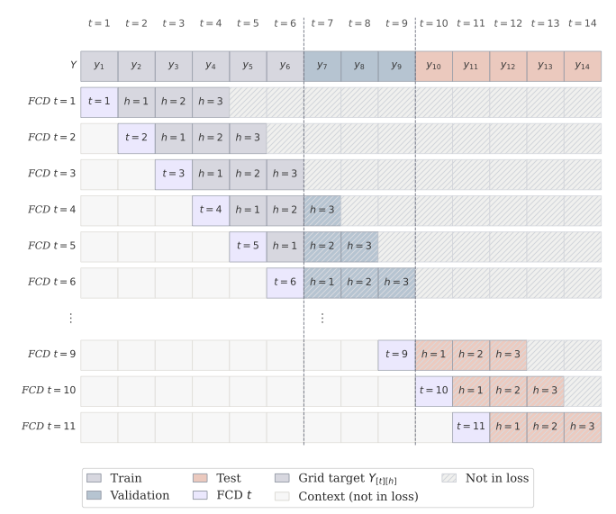
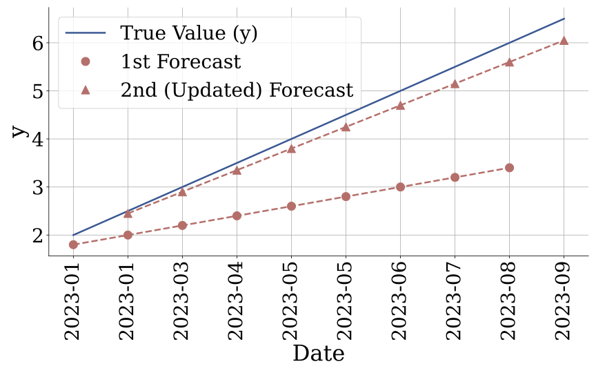
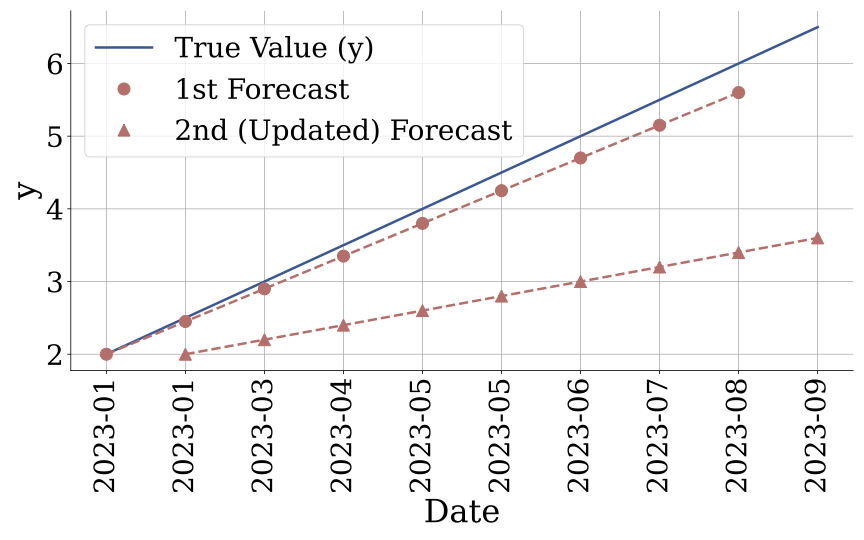
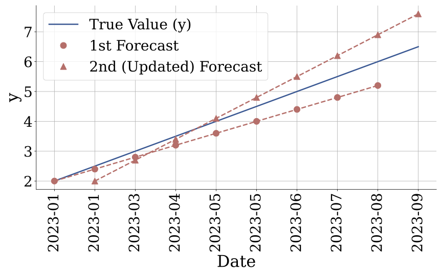
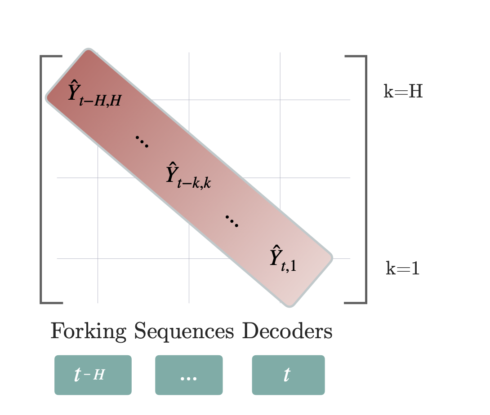
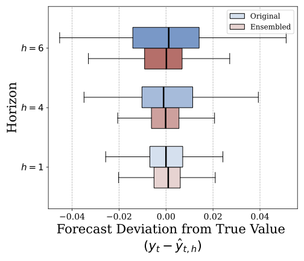

# Time Series Forecasting Pipeline

<br>

---

<br>

## Table of Contents

| | Section |
|---|---|
| 1  | [Quick Start](#quick-start)                       |
| 2  | [Moduler Model Build](#moduler-model-build)       |
| 3  | [Dataloaders](#dataloaders)                       |
| 4  | [Forking-Sequences](#forking-sequences)           |
| 5  | [Training](#training)                             |
| 6  | [Validation Strategies](#validation-strategies)   |
| 7  | [Metrics](#metrics)                               |
| 8  | [Inference](#inference)                           |
| 9  | [Forecast Ensembling](#forecast-ensembling)       |
| 10 | [License](#license)                               |

<br>

---

<br>

## Quick Start

### 1. Edit Model Config
Add or edit a model config file in `configs/model/`.

### 2. Edit Dataset Config
Add or edit dataset config files in `configs/dataset/`.

### 3. Edit Base Config
Edit default config file in `configs/base/`.

### 4. Train and Evaluate Model

```python
device = torch.device(cfg.device)
cfg.model.h = cfg.dataset.train[0].horizon
factory      = DataLoaderFactory(cfg.model, cfg.dataset)
train_loader = factory.train_dataloader()
val_loaders  = factory.val_dataloaders()
model = Tranformer(cfg.model)

# ────── Train ──────
train(
    model        = model,
    mcfg         = cfg.model,
    train_loader = train_loader,
    val_loaders  = val_loaders,
    device       = device,
    seed         = cfg.base.seed,
    resume       = cfg.get("resume", None),
)
# ────── Test ──────
eval_test(model, factory)
```

<br>

[↑ Back to top](#time-series-forecasting-pipeline)

<br>

---

<br>


## Moduler Model Build

When adding a model config file in `config/models/`, select encoder, decoder, and output layer.
Any component can be set to `none` to skip it.
```yaml
d_model: 256
encoder: patchtst      # or none
decoder: none          # or transformer, google/t5-efficient-tiny, etc.
output_layer: linear_proj  # or none
```

### Encoders

| `encoder` | Notes |
|---|---|
| `patchtst` | PatchTST-style transformer — recommended default |
| `google/t5-efficient-tiny` | T5 backbone — use `d_model: 256` |
| `google/t5-efficient-mini` | |
| `google/t5-efficient-small` | |
| `google/t5-efficient-base` | |
| `google/t5-efficient-large` | |
| `none` | No encoder — input passed directly to decoder or output layer |

### Decoders

| `decoder` | Notes |
|---|---|
| `none` | No decoder — encoder output passed directly to output layer |

### Output Layers

| `output_layer` | Notes |
|---|---|
| `linear_proj` | Projects last dimension to H × c_out, where c_out is the loss output dimension |
| `none` | No projection — returns encoder/decoder output as-is |

<br>

[↑ Back to top](#time-series-forecasting-pipeline)

<br>

---

<br>


## Dataloaders


### Dataset Config

Dataset configs define paths, train/val/test splits, exogenous features, and per-dataset sampling weights. Multiple datasets can be listed as separate entries under `train`, `validation`, and `test`.

```yaml
train:
  - path: "../datasets/simglucose_90_days.csv"
    name: "simglucose"
    horizon: 6
    val_size: 2592        # timesteps reserved for validation
    test_size: 2592       # timesteps reserved for test
    weight: 1.0           # relative sampling weight during training
    hist_exog_cols: [CHO, insulin]
    per_series_split: False
```

<br>


### DataLoaderFactory

Central object that owns all dataset construction and dataloader creation.

```python
factory      = DataLoaderFactory(mcfg, dcfg)
train_loader = factory.train_dataloader()
val_loaders  = factory.val_dataloaders()
test_loaders = factory.test_dataloaders()
```

<br>

### FullSeriesDataset

Each dataset is a single item (`__len__ == 1`) — the entire series delivered to the model in one shot. `fork_sequences` handles all windowing inside `_prepare_batch`.

<br>

### HorizonBatchSampler

Groups datasets by horizon so all items in a batch share the same `H`. Required for autoregressive rollouts — each batch must have a consistent forecast length.

| Strategy | Behaviour |
|---|---|
| `concat` | Multiple datasets pooled into each batch, sampled by weight. Heterogeneous series lengths handled by left-padding at collation. |
| `round_robin` | One dataset per batch, rotating across datasets each round. Weights control how many batches each dataset contributes before it is exhausted. |

<br>

[↑ Back to top](#time-series-forecasting-pipeline)

<br>

---

<br>

## Forking-sequences



Fig. Example of a forking-sequences target grid. The validation set, marked in blue, corresponds to the data
between the dotted lines, while the test set is shown in orange. Forking-sequences architectures generate forecasts for
all FCDs simultaneously by reusing the encoder’s computations, whereas window-sampling produces forecasts for each
FCD independently. A masking strategy depicted with hatching lines prevents temporal leakge.


```python
from dataloaders._forking_sequences import fork_sequences, n_valid_fcds

# Training — sample fcd_samples windows per series
out = fork_sequences(batch, context_length=512, fcd_samples=4, horizon=6)

# Val / Test — all valid windows, no sampling
out = fork_sequences(batch, context_length=512, fcd_samples=-1, horizon=6)
```

<br>

### heterogeneous_sampler

Called during training (`fcd_samples != -1`) to pick one `window_start` per series. A timestep is only valid if **all channels** have real data there — this naturally skips left-padding and mid-series gaps. Sampling is via `torch.multinomial` so each series gets an independent draw.

```
Homogeneous sampling — same window_start for all series
──────────────────────────────────────────────────────────
series 1   [1 1 1 1 1 1 1 1 1 1 1 1 1 1 1 1 1 1 1 1 1 1 1]
                        [──── L ────][── H ──]

series 2   [0 0 0 0 0 0 1 1 1 1 1 1 1 1 1 1 1 1 1 1 1 1 1]
                        [──── L ────][── H ──]

series 3   [0 0 0 0 0 0 0 0 0 0 0 1 1 1 1 1 1 1 1 1 1 1 1]
                        [──── L ────][── H ──]
                          ^ ^ ^ ^ L samples padding

Heterogeneous sampling — independent window_start per series
──────────────────────────────────────────────────────────
series 1   [1 1 1 1 1 1 1 1 1 1 1 1 1 1 1 1 1 1 1 1 1 1 1]
               [──── L ────][── H ──]

series 2   [0 0 0 0 0 0 1 1 1 1 1 1 1 1 1 1 1 1 1 1 1 1 1]
                         [──── L ────][── H ──]

series 3   [0 0 0 0 0 0 0 0 0 0 0 1 1 1 1 1 1 1 1 1 1 1 1]
                                  [──── L ────][── H ──]
```

<br>

[↑ Back to top](#time-series-forecasting-pipeline)

<br>

---

<br>

## Training

### Single GPU
```python
from common.train import train

train(model, mcfg, train_loader, val_loaders, device=torch.device("cuda"))

# Resume from checkpoint
train(model, mcfg, train_loader, val_loaders, resume="checkpoints/final.pt")
```

### Multiple GPUs

**torchrun** (recommended):
```bash
torchrun --nproc_per_node=4 train_script.py
```

**mp.spawn** (programmatic, single-machine):
```python
from common.train import train_distributed

train_distributed(model, mcfg, factory, use_spawn=True, world_size=4)
```

Sharded datasets are the recommended backend for distributed training — each rank loads a non-overlapping subset of shard files.

| Phase | Behaviour |
|---|---|
| **Training** | Each rank receives a non-overlapping slice of every horizon group's pool. Padding ensures identical batch counts across ranks — required by DDP's barrier synchronisation. |
| **Validation** | Every rank evaluates the full val set independently (same data, different model weights). Losses are all-reduced and averaged for the global metric. Only rank 0 logs and saves checkpoints. |
| **Test** | Always single GPU. Call `eval_test()` after `dist.destroy_process_group()` has been called. |

### Data Sharding

For datasets too large to fit in RAM, `write_sharded_dataset` partitions data into time-blocked parquet files with configurable shard size.

#### Writing Shards

```python
from dataloaders.ts_sharding import write_sharded_dataset

write_sharded_dataset(
    df             = full_df,           # long-format DataFrame — must have 'available_mask'
    out_dir        = "data/sharded/simglucose",
    val_size       = 2592,              # matches dcfg entry val_size
    test_size      = 2592,              # matches dcfg entry test_size
    context_length = 512,               # L — baked into shard overlap
    shard_size     = 5_000,             # train timesteps per file
    hist_exog_cols = ["CHO", "insulin"],
)
```

#### Disk Layout

```
out_dir/
    shard_000000.parquet   # t = [0,          shard_size + L)
    shard_000001.parquet   # t = [shard_size,  2·shard_size + L)   ← L-row overlap
    ...
    val.parquet            # t = [train_end - L,  val_end)
    test.parquet           # t = [val_end - L,    T_total)
    static.parquet         # per-channel static features
    metadata.json          # split boundaries, schema, shard index
```

The **L-row right-edge overlap** on each train shard means windows near shard boundaries are self-contained — no cross-file reads needed.

#### Using Shards
First write the shards with `write_sharded_dataset`, then point your dataset config entry at the output directory:
```yaml
- name: "simglucose"
  sharded_dir: "data/sharded/simglucose"
  horizon: 6
  weight: 1.0
```

`path` is not required when `sharded_dir` is set. The factory uses `ShardedTrainDataset`, 
`ShardedValDataset`, and `ShardedTestDataset` directly.

<br>

[↑ Back to top](#time-series-forecasting-pipeline)

<br>

---

<br>

## Metrics

### Training Losses

Select the loss via `mcfg.loss`:

| `mcfg.loss` | Function | Extra config |
|---|---|---|
| `"mae"` | `mae_loss` | — |
| `"mse"` | `mse_loss` | — |
| `"huber"` | `huber_loss` | `delta: 1.0` |
| `"quantile"` | `quantile_loss` | `quantiles: [0.1, 0.5, 0.9]` |

All point-forecast losses share the same signature:
```python
loss_fn(
    preds:   torch.Tensor,         # [B, H, C]
    targets: torch.Tensor,         # [B, H, C]
    mask:    torch.Tensor | None,  # [B, H, C]  1=real, 0=padded/missing
) -> torch.Tensor                  # scalar
```

Masked reduction applied by every loss:
```python
(raw_loss * mask).sum() / mask.sum().clamp(min=1)
```

When `mask is None` a plain `.mean()` is used — equivalent to a mask of all ones.

<br>

### Accuracy Metrics
```python
from common.losses_np import mae, mse, rmse, mape, smape
```

| Function | Formula |
|---|---|
| `mae`   | `mean( \|y − ŷ\| )` |
| `mse`   | `mean( (y − ŷ)² )` |
| `rmse`  | `sqrt( mse )` |
| `mape`  | `mean( \|y − ŷ\| / \|y\| ) × 100` |
| `smape` | `mean( 2\|y − ŷ\| / (\|y\| + \|ŷ\|) ) × 100` |
```python
metric_fn(
    preds:   np.ndarray,        # [..., H, C]
    targets: np.ndarray,        # [..., H, C]
    mask:    np.ndarray | None, # [..., H, C]  1=real, 0=missing
) -> float
```
```python
preds   = results["simglucose"]["preds"].numpy()           # [n_fcds, H, C]
targets = results["simglucose"]["targets"].numpy()         # [n_fcds, H, C]
mask    = results["simglucose"]["outsample_mask"].numpy()  # [n_fcds, H, C]

print("MAE: ", mae(preds, targets, mask))
print("RMSE:", rmse(preds, targets, mask))
```

> **Quantile models** — pass only the median slice to point-forecast metrics:
> ```python
> Q   = len(mcfg.quantiles)
> mid = mcfg.quantiles.index(0.5)
> p_median = preds.reshape(*preds.shape[:-1], -1, Q)[..., mid]
> print("Median MAE:", mae(p_median, targets, mask))
> ```

<br>

### Stability Metrics

Stability metrics operate on the overlapping structure of forking sequences — multiple forecast windows predict the same target date from different horizons, so revisions across consecutive windows can be measured directly.
```python
from common.losses_np import excess_volatility, forecast_percentage_change
```

#### Excess Volatility (EV)
Measures harmful forecast instability: revisions that incur a quantile-loss cost without a corresponding accuracy improvement.

<div style="display: flex; gap: 10px;">
  
  
  
</div>

Fig. Example penalty behavior of the Excess Volatility (EV) metric. EV distinguishes accuracy-improving
revisions from accuracy-degrading ones, assigning no penalty when revisions improve accuracy, while asymmetrically
penalizing both deteriorating and overshooting revisions according to their impact on accuracy.

<br>


```
EV = QL(ŷ_update_median, ŷ_before)        # revision cost
   − (QL(y, ŷ_before) − QL(y, ŷ_update))  # accuracy improvement
```
```python
ev = excess_volatility(
    y=targets[None],       # [1, n_fcds, H, C]
    preds=preds[None],     # [1, n_fcds, H, C, Q]
    quantiles=mcfg.quantiles,
    mask=mask[None],
)
```

> Lower is better. A value near zero means revisions are justified by accuracy gains; a large positive value flags unnecessary forecast churn.

#### Symmetric Forecast Percentage Change (sFPC)

Measures the relative magnitude of revisions without reference to ground truth — can be computed on live windows where actuals are unavailable.
```
sFPC = 200 × mean( |ŷ_update − ŷ_before| / (|ŷ_update| + |ŷ_before| + ε) )
```
```python
sfpc = forecast_percentage_change(
    preds=p_median[None],  # [1, n_fcds, H, C]
    mask=mask[None],
)
```

> Lower is better.

<br>

[↑ Back to top](#time-series-forecasting-pipeline)

<br>

---

<br>

## Validation Strategies

Controlled by `mcfg.val_strategy`:

| Strategy | Behaviour | Best for |
|---|---|---|
| `exhaustive` | Full pass over all val datasets every check | Final evaluation, small dataset counts |
| `random_datasets` | K random datasets per check (`val_max_datasets`) | Many datasets, preventing val overfitting |
| `stratified` | One random dataset per horizon group | Fast convergence signal across all horizons |

> Test always uses `exhaustive` evaluation regardless of `val_strategy`.

<br>

[↑ Back to top](#time-series-forecasting-pipeline)

<br>

---

<br>


## Inference

```python
results = eval_test(model, factory, device=torch.device("cuda"))
```

Returns a nested dict keyed by dataset name:

```python
{
    "simglucose": {
        "channel_ids":    ["patient_001", "patient_002", ...],
        "preds":          Tensor,   # [n_fcds, H, C]
        "targets":        Tensor,   # [n_fcds, H, C]
        "outsample_mask": Tensor,   # [n_fcds, H, C]   1 = real, 0 = missing
    }
}
```

<br>

[↑ Back to top](#time-series-forecasting-pipeline)

<br>
 
---
 
<br>
 

## Forecast Ensembling
Because forking sequences produce multiple overlapping predictions for anygiven future timestep, ensembling these overlaps can meaningfully reduce
variance before computing final metrics.

<div style="display: flex; gap: 10px;">
  
  
</div>
Fig. a) We adapt forking-sequences during inference to ensemble multiple forecasts of the same future date by
computing a function (ex., moving average) across predictions generated from previous FCDs. b) Forking-sequences
ensembling improves forecasts’ stability, reducing the estimators variance with a linear convergence rate analogous to
the weak law of large numbers.

<br>

```python
from common.ensembling import Ensembler

ensembler = Ensembler(ensemble_method='mean')
smoothed  = ensembler.ensemble(preds, mask=outsample_mask)
# [B, T, H, C]  →  [B, T, H, C]
```

### Methods

| `ensemble_method` | Behaviour | Key kwargs |
|---|---|---|
| `mean`     | Cumulative (or windowed) mean over overlapping windows   | `window_size=None` |
| `median`   | Cumulative (or windowed) median — robust to outlier windows | `window_size=None` |
| `ewm`      | Exponentially weighted mean — recency-biased             | `alpha=0.5`, `window_size=None` |
| `identity` | No aggregation — pass-through                           | — |

`window_size=None` uses all available overlapping windows. Set an integer
to limit aggregation to the N most recent overlaps.

### Masking

Pass `outsample_mask` directly — masked timesteps (`0`) are treated as
`NaN` internally and excluded from every aggregation operation, so padded
channels and missing values never contaminate the ensemble.

### Typical Usage
```python
results = eval_test(model, factory, device=torch.device("cuda"))

preds = results["simglucose"]["preds"].numpy()           # [n_fcds, H, C]
mask  = results["simglucose"]["outsample_mask"].numpy()  # [n_fcds, H, C]

# Ensembler expects [B, T, H, C] — add batch dim
ensembler = Ensembler(ensemble_method='ewm', alpha=0.3)
smoothed  = ensembler.ensemble(preds[None], mask=mask[None])[0]  # [n_fcds, H, C]

print("Ensemble MAE:", mae(smoothed, targets, mask))
```

<br>

[↑ Back to top](#time-series-forecasting-pipeline)

<br>

---

<br>

## License

MIT License

Copyright (c) 2024 Auton Lab, Carnegie Mellon University

Permission is hereby granted, free of charge, to any person obtaining a copy of this software and associated documentation files (the "Software"), to deal in the Software without restriction, including without limitation the rights to use, copy, modify, merge, publish, distribute, sublicense, and/or sell copies of the Software, and to permit persons to whom the Software is furnished to do so, subject to the following conditions:

The above copyright notice and this permission notice shall be included in all copies or substantial portions of the Software.

THE SOFTWARE IS PROVIDED "AS IS", WITHOUT WARRANTY OF ANY KIND, EXPRESS OR IMPLIED, INCLUDING BUT NOT LIMITED TO THE WARRANTIES OF MERCHANTABILITY, FITNESS FOR A PARTICULAR PURPOSE AND NONINFRINGEMENT. IN NO EVENT SHALL THE AUTHORS OR COPYRIGHT HOLDERS BE LIABLE FOR ANY CLAIM, DAMAGES OR OTHER LIABILITY, WHETHER IN AN ACTION OF CONTRACT, TORT OR OTHERWISE, ARISING FROM, OUT OF OR IN CONNECTION WITH THE SOFTWARE OR THE USE OR OTHER DEALINGS IN THE SOFTWARE.

See [MIT LICENSE](https://github.com/mononitogoswami/labelerrors/blob/main/LICENSE) for details.

<br>

[↑ Back to top](#time-series-forecasting-pipeline)